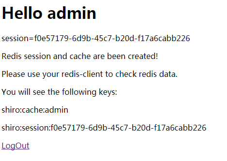

# shiro-redis-tutorial

This is a tutorial help you to know how to use shiro-redis.
This tutorial use shiro.ini to configure shiro and shiro-redis.

How to use it?
==============

1. Use the following comment to clone shiro-redis-tutorial to your disk:
```
git clone https://github.com/alexxiyang/shiro-redis-tutorial.git
```
2. Modify redis service connection configuration in src/main/resources/shiro.ini.
Such as `redisManager.host`, `redisManager.port`, etc.
```INI
redisManager.host = 127.0.0.1
# Redis port. Default value: 6379 (Optional)
redisManager.port = 6379
# Redis cache key/value expire time. Default value:0 .The expire time is in second (Optional)
redisManager.expire = 600
# Redis connect timeout. Timeout for jedis try to connect to redis server(In milliseconds).(Optional)
redisManager.timeout = 0
# Redis password.(Optional)
#redisManager.password =
```

3. Run jetty
```
mvn jetty:run
```

4. Visit `http://localhost:8080`, you will see login page:


5. Use the username and password wrote on login page to sign in.
Then you will see the successful page:



6. Use redis client to check redis data. For example, use Redis Desktop Manager:


It means shiro use redis as its session and cache solution successfully.

How to add shiro-redis to your project?
=======================================
From this tutorial, we can know that you if you want to use shiro-redis, you need to following these steps:
1. Add shiro-redis dependency. (I assume you already shiro dependencies):
```XML
<!-- shiro-redis dependencies -->
<dependency>
    <groupId>org.crazycake</groupId>
    <artifactId>shiro-redis</artifactId>
    <version>2.4.2.1-RELEASE</version>
</dependency>
```

2. Add shiro-redis configuration to `shiro.ini`
```INI
#====================================
# shiro-redis configuration [start]
#====================================

#===================================
# Redis Manager
#===================================
# Create redisManager
redisManager = org.crazycake.shiro.RedisManager
# Redis host. If you don't specify host the default value is 127.0.0.1 (Optional)
redisManager.host = 192.168.56.101
# Redis port. Default value: 6379 (Optional)
redisManager.port = 6379
# Redis cache key/value expire time. Default value:0 .The expire time is in second (Optional)
redisManager.expire = 600
# Redis connect timeout. Timeout for jedis try to connect to redis server(In milliseconds).(Optional)
redisManager.timeout = 0
# Redis password.(Optional)
#redisManager.password =

#====================================
# Redis-based session configuration
#====================================
# Create redisSessionDAO
redisSessionDAO = org.crazycake.shiro.RedisSessionDAO
# Custom your redis key prefix for session management, if you doesn't define this parameter, shiro-redis will use 'shiro_redis_session:' as default prefix
# Note: Remember to add colon at the end of prefix.
redisSessionDAO.keyPrefix = shiro:session:
# Use redisManager as cache manager
redisSessionDAO.redisManager = $redisManager
sessionManager = org.apache.shiro.web.session.mgt.DefaultWebSessionManager
sessionManager.sessionDAO = $redisSessionDAO
securityManager.sessionManager = $sessionManager

#=====================================
# Redis-based cache configuration
#=====================================
# Create cacheManager
cacheManager = org.crazycake.shiro.RedisCacheManager
# Custom your redis key prefix for cache management, if you doesn't define this parameter, shiro-redis will use 'shiro_redis_session:' as default prefix
# Note: Remember to add colon at the end of prefix.
cacheManager.keyPrefix = shiro:cache:
# Use redisManager as cache manager
cacheManager.redisManager = $redisManager
securityManager.cacheManager = $cacheManager

# This realm is just for tutorial
exampleRealm = org.crazycake.shiroredis.ExampleRealm
# Note: Remember to set authenticationCachingEnabled to true, otherwise shiro will not use cache.
exampleRealm.authenticationCachingEnabled = true
securityManager.realm = $exampleRealm

#=================================
# shiro-redis configuration [end]
#=================================
```

Done!

If you found any problems
=========================

Please send email to alexxiyang@gmail.com